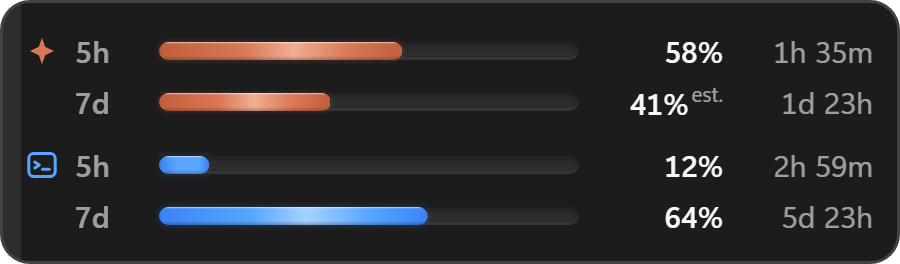

# FluxDock

A small Windows widget that shows how much of your Claude Code and Codex CLI
limits you have left, for both the rolling five hour window and the weekly one.

It runs as a floating widget above the taskbar, or pinned into the taskbar strip
next to the clock.


```
Placement: floating          Placement: pinned to taskbar
```


## Why

Both tools enforce two limits at once, and the one that stops your work is
usually not the one you were watching. Checking means interrupting yourself to
run a command, and the answer is stale the moment you go back to work.

FluxDock keeps both windows on screen with a countdown to the next reset, so the
question is answered before you ask it.

## Features

- **Both limit windows per tool.** Five hour and weekly, each with its own bar
  and countdown to the reset.
- **Server numbers first.** Claude Code figures come from the official usage
  endpoint. Anything derived locally is marked `est.` so the two are never
  confused.
- **Two placements.** A floating window that docks to the corner of the work
  area, or pinned into the taskbar strip left of the notification area. Switch
  from the tray menu.
- **Stays where you put it.** Monitor identity is stored, not coordinates, so
  unplugging a display, sleeping, or changing scaling does not strand the widget
  off screen.
- **Gets out of the way.** Hides automatically while a fullscreen application is
  in front, including borderless windowed games.
- **Burn rate and time to exhaustion** in the tooltip, alongside the token
  breakdown for the current block.
- **Threshold notifications** at 70% and 90%, once per window.
- **Follows the Windows theme** without a restart, and honours reduced motion.
- **Machine readable status** at `%APPDATA%\FluxDock\state.json` for status bars
  and scripts.


## Install

One line, in PowerShell:

```powershell
irm https://raw.githubusercontent.com/kalaylienes/fluxdock/main/scripts/install.ps1 | iex
```

It downloads the latest installer from the releases page and runs it silently.
Per user install, no administrator prompt, fetches the WebView2 runtime if the
machine does not already have it.

Already using [Scoop](https://scoop.sh)?

```powershell
scoop bucket add fluxdock https://github.com/kalaylienes/fluxdock
scoop install fluxdock
```

Or grab the installer or a portable zip by hand from the
[releases page](https://github.com/kalaylienes/fluxdock/releases).

Requirements: Windows 10 or 11.

Nothing to configure afterwards. If Claude Code or Codex CLI is signed in, the
bars fill within a few seconds of the first launch.

The binary is not code signed yet, so Windows SmartScreen will warn on first
run. Choose **More info**, then **Run anyway**, or build it yourself from
source below and judge the code directly.

## Using it

The tray icon is the control surface.

| Action | Result |
| --- | --- |
| Left click the tray icon | Show or hide the widget |
| Right click the tray icon | Full menu |
| Right click the widget | The same menu |
| Hover a row | Source, measurement time, burn rate, reset, token breakdown |
| Drag the left edge | Move the floating widget; the position is remembered |

The tray icon is tinted by the highest live window: green below 70%, amber to
90%, red above, grey when nothing is fresh.

Windows 11 hides new tray icons behind the overflow arrow by default. Drag it
onto the taskbar to keep it visible. If the widget is ever lost, running the
executable again brings it back rather than starting a second copy.

## How the numbers are produced

Two layers, and the widget always tells you which one you are looking at.

**Claude Code.** The OAuth usage endpoint reports the authoritative percentage
for each window. It is polled on a schedule you choose in the menu, defaulting
to three minutes. Between polls, local transcripts under `~/.claude/projects`
are read incrementally to interpolate the value, and the calibration factor
between local token weight and the official percentage is refit on every
successful poll. Any figure that has drifted from the official one is labelled.

**Codex CLI.** The CLI writes rate limit snapshots into its rollout transcripts.
Those percentages come from the server and are never recomputed from token
counts. They only advance while Codex is running, so the age of a snapshot is
shown and a bar greys out once it is older than the window it describes. When no
recent transcript exists, the CLI's app server is asked directly.



Reading local files never consumes quota. The only exception is refreshing an
expired Claude token, which delegates to the CLI, costs a negligible amount, and
is limited to one attempt per hour. It can be turned off in the settings file.

## Configuration

Everything in the menu is persisted to `%APPDATA%\FluxDock\settings.json`. The
file can be edited by hand, and a few options live only there:

| Key | Meaning |
| --- | --- |
| `widget.tray_gap` | Logical gap between the widget and the notification area when pinned |
| `providers.claude.credential_paths` | Extra credential locations for multiple accounts |
| `providers.claude.allow_cli_refresh` | Whether an expired token may be refreshed through the CLI |
| `polling.http_interval_secs` | Poll interval in seconds, clamped to 60 and 3600 |

`CLAUDE_CONFIG_DIR` and `CODEX_HOME` are honoured, so non standard install
locations work without configuration.

Run with `--demo` to see the interface driven by synthetic values, which is
useful for reviewing the layout before your own usage builds up.

## Privacy

- Files are read from the CLI directories, never written to.
- Credentials are read only. FluxDock never writes to a provider's auth file and
  never asks you for a token.
- Outbound requests go to the provider APIs and nowhere else. There is no
  update check, no analytics endpoint, and no telemetry of any kind.
- Prompt and response content is not parsed or stored. Only token counts,
  timestamps and rate limit fields are read.
- Logs and state stay in `%APPDATA%\FluxDock`.

FluxDock does not inject into any process, hook any graphics API, or read
another process's memory. It draws its own top level window and reads window
geometry, which is why it sits alongside anti cheat protected games without
touching anything they care about. It hides during fullscreen by default anyway.

## Performance

Measured on a release build while a coding session was actively writing
transcripts, which is the worst case for the file watcher:

| Metric | Measured |
| --- | --- |
| CPU, share of the whole system | under 0.03% |
| Resident memory | 30 to 60 MB |
| Installer | 2.4 MB |

Bar animation runs entirely on the compositor. The fill is drawn with two
opposing translations rather than an animated width, so no frame triggers
layout. Countdowns tick once a minute unless a reset is inside its final hour.

## Building

Requirements: Rust stable with the MSVC toolchain, Node.js 20 or later, Visual
Studio Build Tools with the C++ workload, and the WebView2 runtime.

```powershell
git clone https://github.com/kalaylienes/fluxdock.git
cd fluxdock
npm install
npm run app:dev      # run in development
npm run app:build    # installer in src-tauri/target/release/bundle
```

Tests:

```powershell
npm test             # interface tests through Playwright
npm run test:rust    # parsing and settings unit tests
```

The interface tests stub the Tauri bridge and drive the real components in a
browser, so layout, animation timing and every error state can be asserted
without launching the app.

## Architecture

| Layer | Stack | Responsibility |
| --- | --- | --- |
| Backend | Rust | Data collection, calibration, placement, tray, settings |
| Frontend | React and TypeScript | Rendering only, no filesystem or network access |
| Shell | Tauri v2 | Window, tray, autostart, single instance |

```
src/                    widget interface
src-tauri/src/
  providers/            one module per data source
  jsonl.rs              incremental transcript reader
  monitor.rs            monitor identity and taskbar geometry
  window.rs             placement, visibility, motion permission
  aggregator.rs         polling loop and notifications
```

The widget is an ordinary top level window. It is never reparented into
`Shell_TrayWnd` and never registered as an appbar, even when pinned: taskbar
placement only reads the strip's geometry. That is what lets it survive an
Explorer restart and keeps it from reserving desktop space or overlapping
taskbar buttons.

## Scope

FluxDock is a read only status widget for tools that enforce a real quota. It is
not a cost dashboard, not a proxy between your CLI and the API, and not
cross platform: the placement logic is written against the Windows shell.

Support is limited to Claude Code and Codex CLI because both expose rolling five
hour and weekly windows with a first party readable source. Other tools were
evaluated against that bar; see [docs/providers.md](docs/providers.md) for what
was checked and why each one was or was not a fit.

If you want historical reporting, per project charts, or cost reconciliation,
tools like [ccusage](https://github.com/ryoppippi/ccusage) cover that well and
run happily alongside this.

## Contributing

Issues and pull requests are welcome. Two things worth knowing:

- Changes to transcript parsing need a fixture with any identifying content
  removed.
- Placement changes should be checked on a multi monitor setup with mixed
  scaling, which is where most layout bugs come from.

## License

GPL-3.0-or-later. See [LICENSE](LICENSE).

The source is fully open: read it, modify it, fork it, build it yourself,
submit changes back. The GPL's copyleft term is what it adds over a permissive
license — anyone who distributes this software, modified or not, including
commercially, must keep the source available under the same terms. A closed,
proprietary resale is not permitted.

FluxDock is an independent project and is not affiliated with, endorsed by, or
sponsored by Anthropic or OpenAI. Claude and Claude Code are trademarks of
Anthropic. Codex is a trademark of OpenAI. The provider glyphs in the widget are
drawn for this project rather than taken from either vendor.
