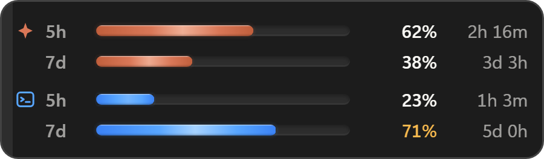
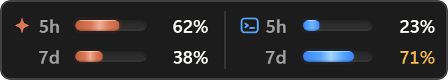
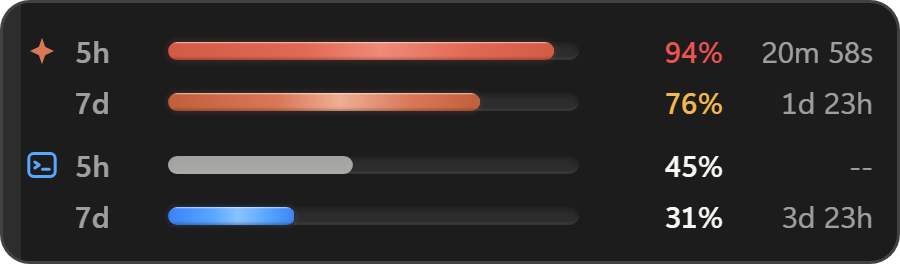

# FluxDock

A small desktop widget that shows how much of your Claude Code, Codex CLI and
Google Antigravity limits you have left, one bar per limit window your account
actually has. Windows and Linux.

It runs as a floating widget above the taskbar, or pinned into the taskbar strip
next to the clock.



<sub>Floating placement. One row per limit window, with the percentage and the
time left before it resets. Antigravity shares a weekly limit per model family
rather than per tool, so its rows are named after the family: `Gem` for the
Gemini models, `3P` for the Claude and GPT ones. The widget is translucent over
whatever is behind it; these shots are flattened so the corners stay clean on
both GitHub themes.</sub>



<sub>Pinned placement. The same numbers as one column per tool, sized to sit
inside the taskbar strip. The strip widens as tools are added rather than
reserving a fixed block of it.</sub>

## Why

These tools enforce more than one limit at a time, and the one that stops your
work is usually not the one you were watching. Checking means interrupting yourself to
run a command, and the answer is stale the moment you go back to work.

FluxDock keeps every window your account has on screen with a countdown to its
reset, so the question is answered before you ask it.

## Features

- **Every limit window your account has.** Each gets its own bar and countdown
  to the reset, named by how long the window runs. Claude Code reports a five
  hour and a weekly window. Codex reports whichever windows the plan is given,
  and OpenAI has changed that set before, so the row is labelled from the
  length the server states rather than from a fixed assumption. Antigravity
  shares one weekly limit per model family, so its rows are named after the
  family instead: `Gem` for the Gemini models, `3P` for the Claude and GPT ones.
- **Server numbers first.** Claude Code figures come from the official usage
  endpoint. Anything derived locally is marked `est.` so the two are never
  confused.
- **Two placements.** A floating window that docks to the corner of the work
  area, or pinned into the taskbar strip left of the notification area. Switch
  from the tray menu.
- **Stays where you put it.** Monitor identity is stored, not coordinates, so
  unplugging a display, sleeping, or changing scaling does not strand the widget
  off screen.
- **Gets out of the way.** Hides automatically while a fullscreen application is
  in front, including borderless windowed games. On more than one monitor it
  only hides for a game on its own screen: a widget on the side display stays
  where it is while the middle one is filled. A window opened across both
  displays covers both, and the widget gets out of the way wherever it sits.
- **Burn rate and time to exhaustion** in the tooltip, alongside the token
  breakdown for the current block.
- **Threshold notifications** at 70% and 90%, once per window.
- **Follows the Windows theme** without a restart, and honours reduced motion.
- **Machine readable status** at `%APPDATA%\FluxDock\state.json` for status bars
  and scripts.



<sub>What a row says besides the number. The first window is past 90% and turns
red, the second is in the warning band and carries `est.` because it was
interpolated between polls rather than read from the server. The grey pair
belongs to a tool that is not running: Codex CLI and Antigravity only report
while they are open, so once a snapshot is older than the window it describes
the bar greys out and the countdown clears rather than showing a number that has
quietly stopped being true.</sub>

## Install

One line, in PowerShell:

```powershell
irm https://raw.githubusercontent.com/kalaylienes/fluxdock/main/scripts/install.ps1 | iex
```

It downloads the latest installer from the releases page and runs it silently.
Per user install, no administrator prompt, fetches the WebView2 runtime if the
machine does not already have it.

Already using [Scoop](https://scoop.sh)?

```powershell
scoop bucket add fluxdock https://github.com/kalaylienes/fluxdock
scoop install fluxdock
```

Or grab the installer or a portable zip by hand from the
[releases page](https://github.com/kalaylienes/fluxdock/releases).

Requirements: Windows 10 or 11.

### On Linux

Download the AppImage from the
[releases page](https://github.com/kalaylienes/fluxdock/releases), make it
executable and run it:

```bash
chmod +x FluxDock_*_amd64.AppImage
./FluxDock_*_amd64.AppImage
```

There is a `.deb` as well, for Debian and Ubuntu:

```bash
sudo apt install ./FluxDock_*_amd64.deb
```

What works, and what does not, is worth being exact about:

| | X11 | Wayland |
| --- | --- | --- |
| Bars, countdowns, all three providers | yes | yes |
| Tray icon and menu | yes, with an indicator extension on GNOME | same |
| Placement on the monitor you chose | yes | no, the compositor decides |
| Drag to a corner, remembered | yes | no |
| Hiding for a fullscreen game | yes, including anything under XWayland | only under XWayland |
| Follows the desktop light and dark setting | yes | yes |
| Start at login | yes | yes |
| Replacing itself when a new version appears | AppImage only | AppImage only |

Wayland has no way for one application to place its own window or to ask what
another one is doing, both by design. Nothing here works around that, so on a
plain Wayland session the widget appears wherever the compositor puts it and
stays there during a game. Most games run through XWayland, which is an X11
client, so fullscreen hiding usually works even inside a Wayland session.

Pinning into a panel is a Windows only feature. The Windows taskbar is an
ordinary window with room inside it; GNOME's top bar is drawn by the desktop
itself and there is no way for another program to put a window in it, so this
is a missing place rather than a missing port. Placement lists the choice
greyed out on Linux rather than hiding it, because a submenu with one entry
reads as something that failed to load.

GNOME needs an AppIndicator extension for any tray icon at all, which is a GNOME
decision rather than something this widget can fix. `libnotify` is what carries
the diagnostic messages; without it they go to the log instead. A `.deb`
install is owned by the package manager, so it never offers to replace itself.

Nothing to configure afterwards. If Claude Code, Codex CLI or Antigravity is
signed in, the bars fill within a few seconds of the first launch.

The binary is not code signed yet, so Windows SmartScreen will warn on first
run. Choose **More info**, then **Run anyway**, or build it yourself from
source below and judge the code directly.

### Updates

FluxDock asks GitHub once every six hours whether a newer release exists. When
there is one, a line appears at the top of the tray menu and stays there until
you click it. Nothing downloads or installs on its own.

Clicking it fetches the installer and checks it against a public key compiled
into the copy you are already running, so a release that was not signed with the
matching private key is refused rather than run. The app then closes for a few
seconds while the installer replaces it, and comes back on the new version.

**Diagnostics → Check for updates** asks straight away and tells you either way.
**Check automatically** in the same submenu turns the six hourly question off; it
is the `updates.check` field in `settings.json` if you would rather edit it there.

Versions before 1.0.3 have no update check at all, so a copy older than that has
to be replaced by hand once.

## Using it

The tray icon is the control surface.

| Action | Result |
| --- | --- |
| Left click the tray icon | Show or hide the widget |
| Right click the tray icon | Full menu |
| Right click the widget | The same menu |
| Hover a row | Source, measurement time, burn rate, reset, token breakdown |
| Drag the left edge | Move the floating widget; the position is remembered |

The tray icon is tinted by the highest live window: green below 70%, amber to
90%, red above, grey when nothing is fresh.

Windows 11 hides new tray icons behind the overflow arrow by default. Drag it
onto the taskbar to keep it visible. If the widget is ever lost, running the
executable again brings it back rather than starting a second copy.

## How the numbers are produced

Two layers, and the widget always tells you which one you are looking at.

**Claude Code.** The OAuth usage endpoint reports the authoritative percentage
for each window. It is polled on a schedule you choose in the menu, defaulting
to three minutes. Between polls, local transcripts under `~/.claude/projects`
are read incrementally to interpolate the value, and the calibration factor
between local token weight and the official percentage is refit on every
successful poll. Any figure that has drifted from the official one is labelled.

**Codex CLI.** The CLI writes rate limit snapshots into its rollout transcripts.
Those percentages come from the server and are never recomputed from token
counts. They only advance while Codex is running, so the age of a snapshot is
shown and a bar greys out once it is older than the window it describes. When no
recent transcript exists, the CLI's app server is asked directly.

**Antigravity.** The Antigravity CLI runs a language server on loopback and
answers a quota call with the same remaining fraction and reset time its own
usage view shows. That call needs no credential, and asking does not spend any
of the quota it reports. The port is different on every start and is written
into the CLI's own log, which is the only file read. Because the server is the
CLI, the numbers stop arriving when you close it: the last reading is kept and
greys out after six hours, since the same account can still be spent from the
IDE or from another machine.

Reading local files never consumes quota. The only exception is refreshing an
expired Claude token, which delegates to the CLI, costs a negligible amount, and
is limited to one attempt per hour. It can be turned off in the settings file.

## Configuration

Everything in the menu is persisted to `%APPDATA%\FluxDock\settings.json`. The
file can be edited by hand, and a few options live only there:

| Key | Meaning |
| --- | --- |
| `widget.tray_gap` | Logical gap between the widget and the notification area when pinned |
| `providers.claude.credential_paths` | Extra credential locations for multiple accounts |
| `providers.claude.allow_cli_refresh` | Whether an expired token may be refreshed through the CLI |
| `polling.http_interval_secs` | Poll interval in seconds, clamped to 60 and 3600 |

`CLAUDE_CONFIG_DIR` and `CODEX_HOME` are honoured, so non standard install
locations work without configuration.

Run with `--demo` to see the interface driven by synthetic values, which is
useful for reviewing the layout before your own usage builds up.

## Keeping it running

FluxDock is meant to be something you stop thinking about, so on Windows there
is an optional watchdog:

```powershell
powershell -ExecutionPolicy Bypass -File scripts/install-watchdog.ps1
```

It registers a scheduled task that starts FluxDock at sign in and checks once a
minute afterwards. If the process is gone for any reason it comes back within
the minute, without asking.

The check is `fluxdock.exe --watchdog`, not a script. A scheduled task that
starts a console program gets a real console window, and where Windows Terminal
is the default host that window shows itself whatever `-WindowStyle` asks for.
Once a minute it would flash in front of everything and take the foreground with
it, which is enough to drop a fullscreen game to the desktop. A GUI binary has
no console to flash.

Quitting from the tray menu is treated as deliberate and the watchdog leaves it
alone. Ending the process from Task Manager is not, so it restarts. To take the
watchdog off again:

```powershell
powershell -ExecutionPolicy Bypass -File scripts/install-watchdog.ps1 -Remove
```

On Linux the same job belongs to the session manager. A user unit is enough:

```ini
# ~/.config/systemd/user/fluxdock.service
[Unit]
Description=FluxDock usage widget
PartOf=graphical-session.target
After=graphical-session.target

[Service]
ExecStart=%h/.local/bin/fluxdock
Restart=on-failure
RestartSec=60

[Install]
WantedBy=graphical-session.target
```

`Restart=on-failure` rather than `always` is the point: quitting from the tray
menu exits cleanly and stays quit, while a kill brings the widget back. That is
the same distinction the Windows watchdog makes, with no code behind it.

If a crash ever does happen, the panic location is written to
`last-crash.txt` in the data directory, along with the rolling logs next to it.
That file is the useful thing to attach to an issue. The directory is
`%APPDATA%\FluxDock` on Windows and `~/.config/FluxDock` on Linux.

## Privacy

- Files are read from the CLI directories, never written to.
- Credentials are read only. FluxDock never writes to a provider's auth file and
  never asks you for a token.
- Outbound requests go to the provider APIs, to the Antigravity CLI's own
  language server on 127.0.0.1, and to GitHub for the update check. Nothing
  else. There is no analytics endpoint and no telemetry of any kind, and the
  update check can be turned off in the tray menu.
- Prompt and response content is not parsed or stored. Only token counts,
  timestamps and rate limit fields are read.
- Logs and state stay in `%APPDATA%\FluxDock`.

FluxDock does not inject into any process, hook any graphics API, or read
another process's memory. It draws its own top level window and reads window
geometry, which is why it sits alongside anti cheat protected games without
touching anything they care about. It hides during fullscreen by default anyway.

## Performance

Measured on a release build while a coding session was actively writing
transcripts, which is the worst case for the file watcher:

| Metric | Measured |
| --- | --- |
| CPU, share of the whole system | under 0.03% |
| Resident memory | 30 to 60 MB |
| Installer | 2.4 MB |

Bar animation runs entirely on the compositor. The fill is drawn with two
opposing translations rather than an animated width, so no frame triggers
layout. Countdowns tick once a minute unless a reset is inside its final hour.

## Building

On Windows: Rust stable with the MSVC toolchain, Node.js 20 or later, Visual
Studio Build Tools with the C++ workload, and the WebView2 runtime.

On Linux, the toolkit development packages as well:

```bash
sudo apt install libwebkit2gtk-4.1-dev libgtk-3-dev \
  libayatana-appindicator3-dev librsvg2-dev libxdo-dev patchelf
npm run tauri build -- --bundles appimage,deb
```

```powershell
git clone https://github.com/kalaylienes/fluxdock.git
cd fluxdock
npm install
npm run app:dev      # run in development
npm run app:build    # installer in src-tauri/target/release/bundle
```

Tests:

```powershell
npm test             # interface tests through Playwright
npm run test:rust    # parsing and settings unit tests
```

The interface tests stub the Tauri bridge and drive the real components in a
browser, so layout, animation timing and every error state can be asserted
without launching the app.

## Architecture

| Layer | Stack | Responsibility |
| --- | --- | --- |
| Backend | Rust | Data collection, calibration, placement, tray, settings |
| Frontend | React and TypeScript | Rendering only, no filesystem or network access |
| Shell | Tauri v2 | Window, tray, autostart, single instance |

```
src/                    widget interface
src-tauri/src/
  providers/            one module per data source
  jsonl.rs              incremental transcript reader
  monitor.rs            monitor identity and taskbar geometry
  window.rs             placement, visibility, motion permission
  aggregator.rs         polling loop and notifications
```

The widget is an ordinary top level window. It is never reparented into
`Shell_TrayWnd` and never registered as an appbar, even when pinned: taskbar
placement only reads the strip's geometry. That is what lets it survive an
Explorer restart and keeps it from reserving desktop space or overlapping
taskbar buttons.

## Scope

FluxDock is a read only status widget for tools that enforce a real quota. It is
not a cost dashboard and not a proxy between your CLI and the API.

It runs on Windows and on Linux. macOS is not supported: the placement, the
panel and the fullscreen sensor would each need a third implementation, and
writing one against a platform nobody here runs is how you ship something that
looks finished and is not.

Support is limited to Claude Code, Codex CLI and Antigravity because all three
expose their limit windows through a first party readable source. Other tools
were evaluated against that bar; see [docs/providers.md](docs/providers.md) for
what was checked and why each one was or was not a fit.

If you want historical reporting, per project charts, or cost reconciliation,
tools like [ccusage](https://github.com/ryoppippi/ccusage) cover that well and
run happily alongside this.

## Contributing

Issues and pull requests are welcome. Two things worth knowing:

- Changes to transcript parsing need a fixture with any identifying content
  removed.
- Placement changes should be checked on a multi monitor setup with mixed
  scaling, which is where most layout bugs come from.

## License

GPL-3.0-or-later. See [LICENSE](LICENSE).

The source is fully open: read it, modify it, fork it, build it yourself,
submit changes back. The GPL's copyleft term is what it adds over a permissive
license — anyone who distributes this software, modified or not, including
commercially, must keep the source available under the same terms. A closed,
proprietary resale is not permitted.

FluxDock is an independent project and is not affiliated with, endorsed by, or
sponsored by Anthropic, OpenAI or Google. Claude and Claude Code are trademarks
of Anthropic. Codex is a trademark of OpenAI. Antigravity and Gemini are
trademarks of Google. The provider glyphs in the widget are drawn for this
project rather than taken from any vendor.
